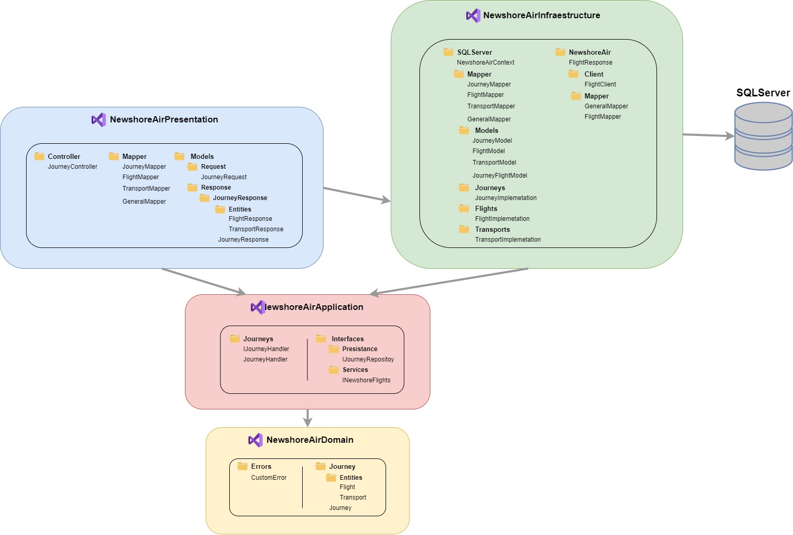

# NewshoreAir

**NewshoreAir** is a project that was developed with a hexagonal architecture, which seeks to solve the problem that arose to connect the trips travel through, this vidaje are hosted on a Newshore server.

## 🖥️Setup
- Programming language: [C#](https://learn.microsoft.com/es-es/dotnet/csharp/)
- Framework: [.NET6](https://learn.microsoft.com/en-us/dotnet/?WT.mc_id=dotnet-35129-website)
- ORM: [Entity Framework](https://learn.microsoft.com/en-us/ef/)
- Data base: [SQL Server](https://www.microsoft.com/es-es/sql-server/sql-server-downloads)
